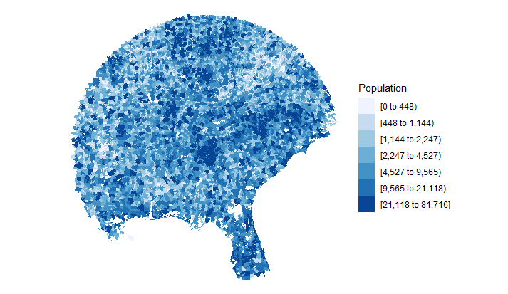

# ZipRadius [](https://travis-ci.org/EAVWing/ZipRadius)
## Stephen Ewing (EAVWing)
## August 9, 2018

This package has been submitted to CRAN but is also available on my Github page:

```r
library(devtools)
install_github('EAVWing/ZipRadius')
```

If you give it a zip code and a radius in miles it returns a data frame containing all of the zip codes that have a center point within the distance specified by the radius.

For example these are the 8 zipcodes within 3.5 miles of zip code 30316:


```r
test <- zipRadius("30316", 3.5)
test
```

```
##     zip    city state latitude longitude Distance
## 1 30303 Atlanta    GA 33.75286 -84.39013     3.26
## 2 30307 Atlanta    GA 33.76821 -84.33786     2.68
## 3 30312 Atlanta    GA 33.74574 -84.37640     2.33
## 4 30315 Atlanta    GA 33.70960 -84.38365     2.82
## 5 30316 Atlanta    GA 33.72951 -84.34087     0.00
## 6 30317 Atlanta    GA 33.75001 -84.31854     1.91
## 7 30335 Atlanta    GA 33.75241 -84.38968     3.22
## 8 31120 Atlanta    GA 33.74000 -84.38000     2.36
```

It also includes 3 functions which can be used with Ari Lamstein's choroplethrZip package.  choroplethrZip is too big to be supported by CRAN so if you want to use it you should install it with:

```r
library(devtools)
install_github('arilamstein/choroplethrZip@v1.3.0')
```

The get states function gives a character vetctor of the states in a zip radius.  Here are the states within 200 miles of 30316:

```r
getStates("30316", 200)
```

```
## [1] "alabama"        "florida"        "georgia"        "north carolina"
## [5] "south carolina" "tennessee"
```

Sometimes you'll need a character vector of the zip codes instead of a data frame:

```r
getZips("30316", 3.5)
```

```
## [1] "30303" "30307" "30312" "30315" "30316" "30317" "30335" "31120"
```

You also could want a data frame that includes just the zip codes as region and the population for those zip codes.  This uses an innerjoin with the population data frame from choroplethrZip so any zip codes that don't appear in both our zip list used for distance measurements and their zip list with populations are dropped.  You'll see this now returns 6 zip codes vs. the 8 returned with the zipRadius function.

```r
getZipPop("30316", 3.5)
```

```
## # A tibble: 6 x 2
##   region value
##   <chr>  <dbl>
## 1 30303   4255
## 2 30307  17344
## 3 30312  18060
## 4 30315  33761
## 5 30316  31282
## 6 30317  11520
```

Finally, here's an example of making a choroplethr of the zip codes in the radius.  I haven't included this function in the package because I can't import choroplethrZip into the package due to its size.

```r
library(ZipRadius)
library(choroplethrZip)
library(ggplot2)

makeZipMap <- function(zipcode, radius){
  choro = choroplethrZip::ZipChoropleth$new(getZipPop(zipcode, radius))
  suppressMessages(suppressWarnings(choro$prepare_map()))
  choro$legend = "Population"
  ec_zips = getZips(zipcode, radius)
  ec_df   = choro$choropleth.df[choro$choropleth.df$region %in% ec_zips,]
  ec_plot = choro$render_helper(ec_df, "", choro$theme_clean())

  ec_plot + ggplot2::coord_map()
}
makeZipMap("30316", 500)
```

